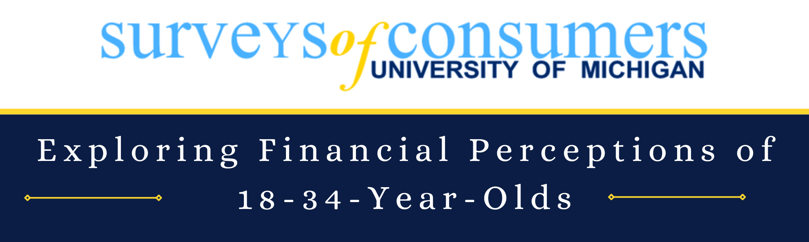
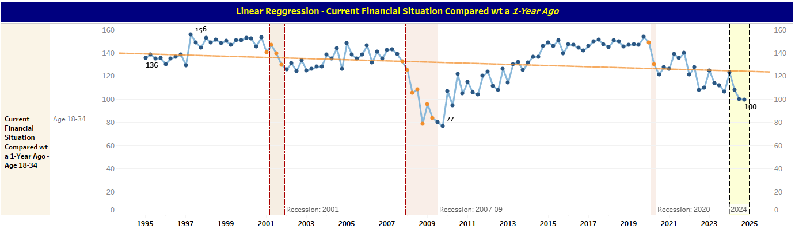
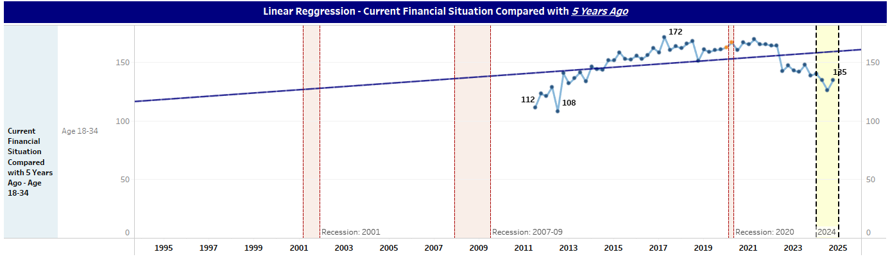
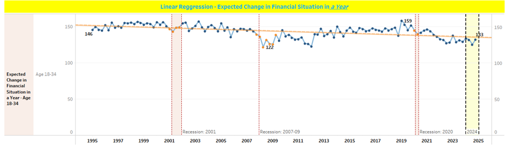
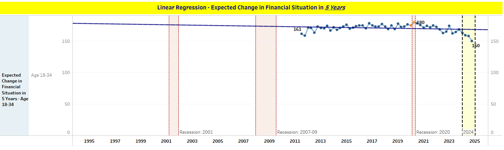
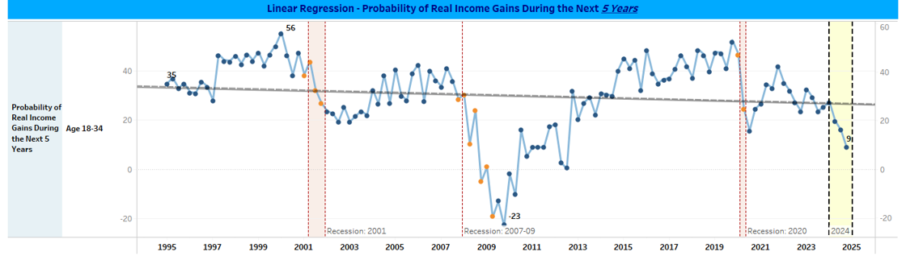
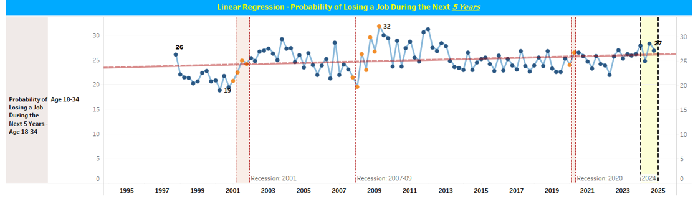

# Economic Insights: Exploring Financial Perceptions of 18-34-Year-Olds

### **Quick Summary:** 

**Overview:** This analysis examines responses from individuals aged 18-34 to personal finance questions from the University of Michigan’s Surveys of Consumers. Visualization for other demographic groups is available; however, I have concentrated on individuals aged 18-34 for this analysis. 

**Visualization:** The data is restructured using Tableau to focus on key recession periods (2001, 2007-09, 2020) and the current economic outlook in 2024. 

**Analyses Conducted:** Tableau was used to create predictive models, such as forecasts and linear regression. The models provided insights into the "Current Financial Situation," "Expected Changes," and "Probabilities of Income Gains and Job Losses."

**Link to Tableau Public Dashboard / Story:**  ADD IT HERE! 

----------------------------------------------------------------------------------------------------------

### **Data Preparation:** 

Data was downloaded from the University of Michigan’s Surveys of Consumers site ( [https://data.sca.isr.umich.edu/subset/subset.php]) at the end of December 2024. However, the data is as of **XX/XX/XXX**.
The data was then restructured to include a column for each personal finance question. The original file separated the responses for each demographic individual (e.g., 18-34, 35-54, 55-97) by personal finance question.
- Using Tableau, the data was pivoted to allow for filtering by demographic groups and personal finance question type.
- Tableau was also used to create groups by personal finance questions by type (e.g. Current Situation Comparison, Expectation of the Future, and Probabilities).

**Helpful Calculations Used:** 
- XX
- XX

**Visualization Notes:** 
- To ensure the charts are not overwhelming, only specific periods were highlighted to show the labels. A calculation with recession dates was created to label dates as "Normal" or "Highlight" periods. 
- Other periods that were displayed were the lowest and highest scores.
  
----------------------------------------------------------------------------------------------------------

## **Series of Analyses:**

### 1. Current Financial Situation Compared to 1-year Ago & 5-years Ago:

**Key Insights:**

•	**Lowest Confidence:** During the Great Recession, the 1-year ago comparison confidence dropped to 77, and the 5-years ago comparison dropped to 108, and then it took a decade to recover. The 2020 pandemic recession triggered another decline, with scores now at 100 and 135 in 2024, respectively. 

•	**Highest Confidence:** For 1-year ago comparisons, confidence peaked in 1997 at 156 but stayed relatively the same until 2001 when it dropped to 141 and then continued down until 2002. Scores did not recover until 2019 Q4, before the 2020 pandemic recession. For the 5-year ago comparison, the score peaked at 172, before the 2001 recession. The 2020 pandemic recession triggered another decline, with scores now at 100 and 135 in 2024, respectively.

**Linear Regression:** 

**Current Financial Situation Compared with 1 Year Ago (Age 18–34)**

•	The linear regression trend shows a small **negative coefficient (-0.0014)**, indicating a slight decline in perceptions over time. With an **R-squared of 0.287**, the model explains about 28.7% of the variance in perceptions, which is statistically significant **(p < 0.0001)** and suggests a meaningful trend in the relationship.

•	Overall, this indicates perceptions of the current financial situation compared to a year ago have gradually declined over time. 

**Current Financial Situation Compared with 5 Years Ago (Age 18–34)**

•	Despite the lower scores at the current moment, the trend shows a slight **positive coefficient (0.0036)**, suggesting that over the long term, perceptions are positive.

•	The **R-squared of 0.125** indicates that about 12.5% of the variance is explained by this model, with statistical significance **(p = 0.008)**. While there is slight optimism about the financial situation compared to 5 years ago, the model suggests limited predictive power for this trend.

----------------------------------------------------------------------------------------------------------
### 2. Expected Changes in Financial Situation: 

**Key Insights:**

•	Currently in 2024 Q4, expectations in the 1-year outlook stand at 133, close to its post-2008 low of 122, signaling minimal optimism. The 5-year outlook has fallen to 150, the lowest since the pandemic recovery began.

•	Interestingly, expectations were more optimistic during the pandemic in 2020, with the 5-year outlook at 161, highlighting hope for rapid recovery at the time.

**Linear Regression:** 

**Expected Financial Situation in 1 Year (Age 18–34)**

•	The trend coefficient is -0.0015, indicating a small but consistent decline in short-term financial expectations among the 18-34 age group. The model’s **R-squared of 0.287** suggests that 28.7% of the variability in expectations can be attributed to the trend. The **p-value (< 0.0001)** demonstrates that this trend is highly significant and unlikely to have occurred by chance. While the R-squared shows room for other influencing factors, the considerable p-value highlights the reliability of the observed trend.

•	Overall, this suggests short-term financial expectations for the coming year are becoming slightly less optimistic. This trend reflects potential short-term uncertainty. However, other factors should be taken into consideration as well. 

----------------------------------------------------------------------------------------------------------

### 3. Probabilities: Income Gains vs. Job Loss:

**Key Insights:**

**Probability of Income Gains:**

•	Currently in 2024 Q4, confidence in income gains over the next 5 years is just 9, lower than during the 2020 pandemic recession, reflecting pessimism about wage growth and economic mobility.

**Probability of Job Loss:**

•	The current outlook as of 2024 Q4, the perception of the probability of Job Loss is at 27, and it has remained elevated, similar to pandemic levels, reflecting continued instability in the labor market.

•	While lower than the peak of 37 in 2020, the score highlights lingering concerns about economic security, even as unemployment rates nationally remain low.

**Linear Regression:** 

**Probability of Real Income Gains in the Next 5 Years (Age 18–34)**

•	A small negative coefficient **(-0.00062)** indicates a decline in optimism for real income gains. The model shows poor power with **R-squared = 0.016**, and the trend is not statistically significant **(p = 0.16)**. Overall, this indicates there is slight pessimism about income growth in the next (e.g. 5 Years ago) showing lower statistical significance potentially indicating when individuals think that far, other factors come into play.5 years, though the trend lacks strong predictive reliability. Similar to other measures that ask about the longer-term number of years comparison and expectations (e.g. 5 years ago and 5 years from now).  

**Probability of Losing a Job in the Next 5 Years (Age 18–34)**

•	The trend suggests a small positive coefficient **(0.00023)**, meaning that perceptions of job loss are slightly increasing. However, the **R-squared of 0.067** suggests a weak model fit, though it is statistically significant **(p = 0.007)**. The increase in the perceived probability of job loss reflects growing concerns among individuals aged 18-43. Higher values are associated with negative perceptions, signaling declining confidence in job stability.

----------------------------------------------------------------------------------------------------------

### Future Research:
As of 2024 Q4, ETFs (e.g., SPY) and the magnificent 7 are at all-time highs and returning double digits annually, and yet we still see low confidence and perceptions of personal finances. This makes me wonder what factors would help individuals feel more positive about personal finances. Future Research should look at:
 
1.	**The relationship between  personal finance questions and other factors such as layoffs, job openings, wage growth, inflation, and stock allocations.** Economic uncertainty, layoffs, and slow wage growth can weigh on young adults' financial outlook and exacerbate concerns about economic security.

2.	**Analyze the same information but with other demographic breakdowns such as income and education levels.** Perhaps other demographic groups feel the economic insecurity less or later in the cycle. 

3.	**It would also be interesting to assess how changes in personal finance confidence influence presidential results.** For example, the 2024 presidential results were recently finalized and as we know from this analysis, most personal finance questions showed confidence decreasing during the last 4 years compared to late 2019 and early 2020. Future Research should assess how presidential results influence confidence levels during the tenure of the sitting president. 

4. **Lastly, it would be helpful to identify Seasonal Cycles** - Identifying seasonal cycles would be helpful for economists and policymakers. Perhaps there are confidence lows or highs that occur during specific quarters, or months.

----------------------------------------------------------------------------------------------------------

### Usage: 
The results should be particularly interesting for policymakers as it would also be critical to understand demographic groups (e.g., regional, education, and income) to help improve their perceptions and confidence levels of their finances. 

### Conclusion:

The financial confidence and expectations of individuals aged 18-34 have been profoundly shaped by economic cycles. While the current outlook in 2024 shows improvement compared to previous recession lows, it remains subdued relative to the highs before the 2020 pandemic recession which caused a sharp decline in confidence and expectations over the past four years. 

## Assumptions and Caveats:
- Please note that certain personal questions either started later than other questions or they seem to have had a pause. I displayed the time series as is with those periods missing. 
- Data was also rounded to the nearest whole across the visualizations to make it easier to read.
